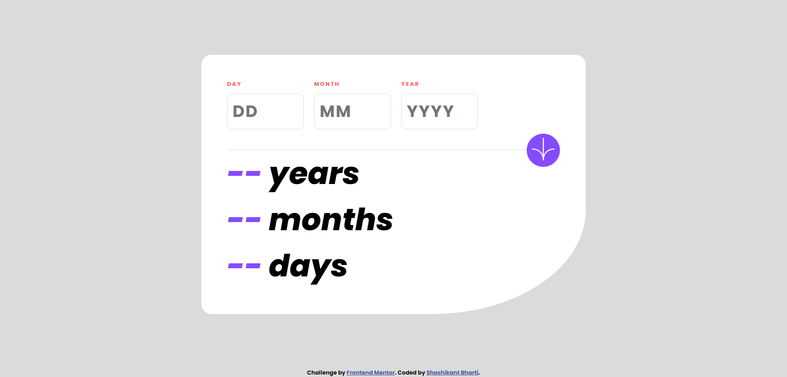

# Age Calculator App - A Frontend Challenge

This is a solution to the [Age Calculator App challenge on Frontend Mentor](https://www.frontendmentor.io/challenges/age-calculator-app-dF9DFFpj-Q). 
Frontend Mentor challenges help us improve coding skills by building realistic projects.

## Table of contents

- [Overview](#overview)
  - [The challenge](#the-challenge)
  - [Screenshot](#screenshot)
  - [Links](#links)
- [My process](#my-process)
  - [Tech Stack](#tech-stack)
  - [What I learned](#what-i-learned)
  - [Continued Development](#CI/CD)
- [Author](#author)
- [Acknowledgments](#acknowledgments)

## Overview

### The challenge

Users should be able to:

- View an age in years, months, and days after submitting a valid date through the form
- Receive validation errors if:
  - Any field is empty when the form is submitted
  - The day number is not between 1-31
  - The month number is not between 1-12
  - The year is in the future
  - The date is invalid e.g. 31/04/1991 (there are 30 days in April)
- View the optimal layout for the interface depending on their device's screen size
- See hover and focus states for all interactive elements on the page
- **Bonus**: See the age numbers animate to their final number when the form is submitted

### Screenshot



### Links

- Solution URL: [Age Calculator Code](https://github.com/manueldinisjunior/age-calculator-app)
- Live Site URL: [Age Calculator](https://manueldinisjunior.github.io/age-calculator-app/)

## My process

- Wrote HTML Code.
- Customized UI with CSS.
- Add JavaScript Functions for page interaction.
- Node Modules
- Git Hub for version control

### Tech Stack

- Semantic HTML5 markup
- CSS custom properties
- Node Modules
- Flexbox
- Mobile-first workflow

### What I learned

- Access the HTML elements in JavaScript
- Get Value from input tag
- Set inner text
- blur event and click event
- Calculating the age

```js
function validYear(y, m, d) {
  const secondDate = new Date();
  const firstDate = new Date(`${y}-${m}-${d}`);
  if (firstDate.setHours(0, 0, 0, 0) <= secondDate.setHours(0, 0, 0, 0)) {
    return true;
  }
  return false;
}
```

### CI/CD

In future projects I would like to precise and optimize code so that minimum possible code should be there in project.

## Author

* Website - [Manuel Dinis Júnior](https://manueldinisjunior.com/)
* LinkedIn - [@manueldinisjunior](https://www.linkedin.com/in//manueldinisjunior)
* Frontend Mentor - [@manueldinisjunior](https://www.frontendmentor.io/profile/manueldinisjunior)
